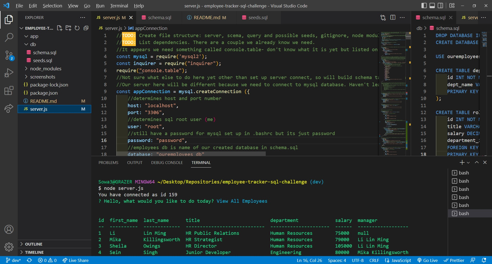
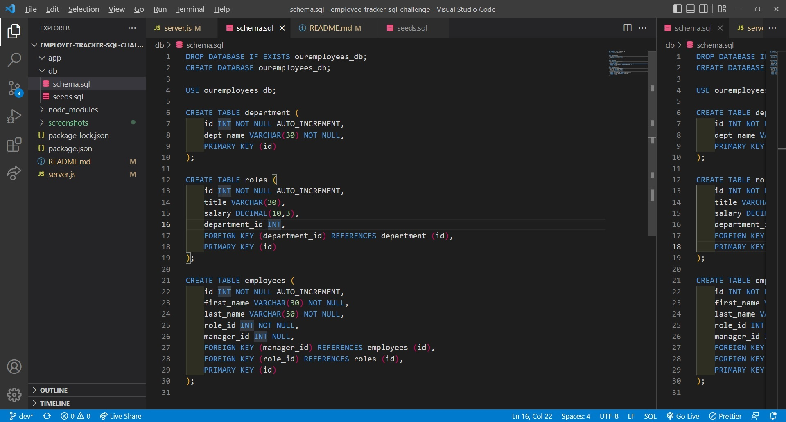
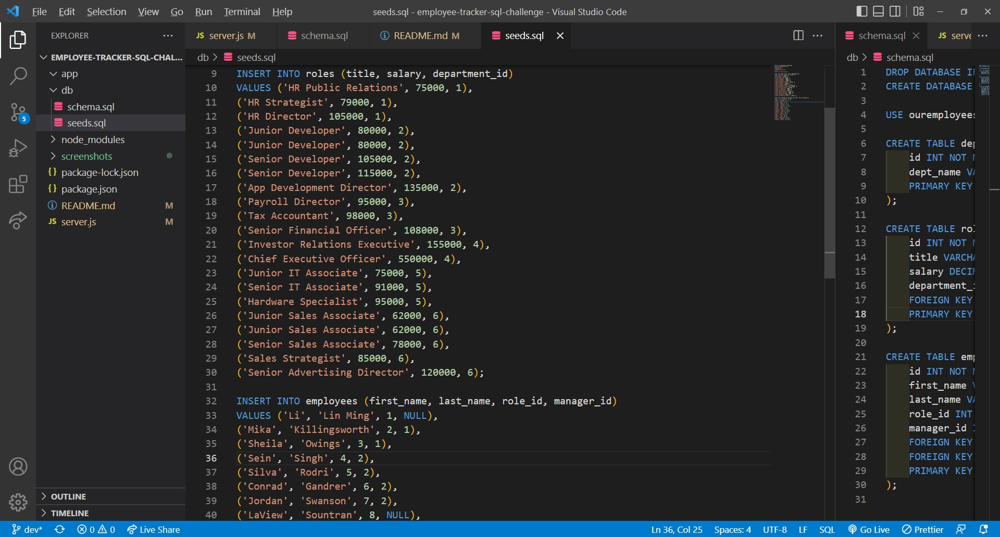
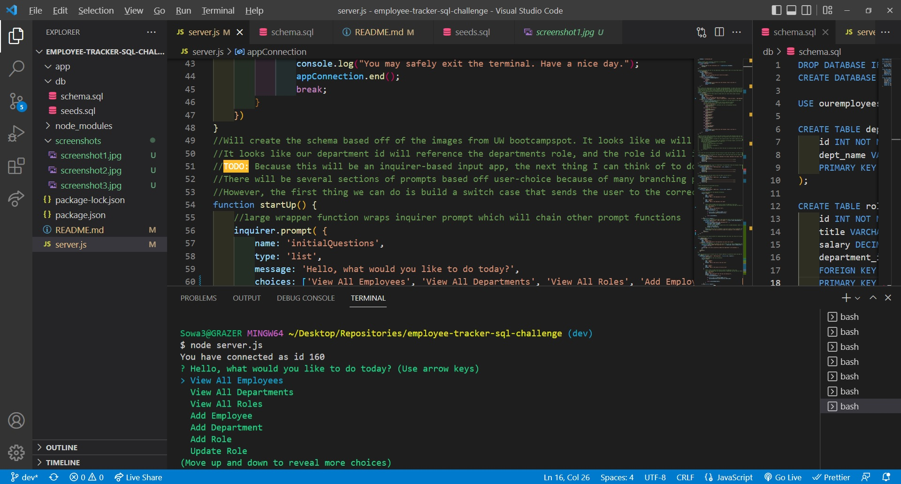

# employee-tracker-sql-challenge

## Video Walkthrough Link

## Table of Contents

- [Description](#description)
- [Installation](#installation)
- [Usage](#Usage)
- [Bugs](#Bugs)
- [Screenshots](#screenshots)
- [Credits](#credits)

## Description

This project involved creating a terminal app in the command line interface using node.js, mysql2, and console.table in order to display data from user input regarding a prospective companies employees, roles, and departments.

- The motivation for creating this project was continuing to develop node.js skills while beginning our journey in MySQL, a vital component of backend development. This was our first homework foray into creating data in mysql and factoring it into a table using javascript, and it turned out to be rather tricky. Between the sheer number of functions required for the inquirer prompts and the complex tableau of syntax needed to correctly factor tables, this was on of the projects that gave me the most issues. There was considerably more trouble-shooting in this projec than some of the other ones, and the interactivity between a number of different files and file types is now providing plenty of space for errors to hide or compound eachother.
- I built this project largely in order to continue to get practice with the skills we are working on in class. MySQL is essentially an entirely new language that requires a different way of thinking when set next to vanilla JavaScript. In some ways, SQL is easier because it is so visual, but syntax is rather tricky and is not always what I imagine it to be when speak it out in my head. This project was also a good lesson in the utility of the command line, which we have used early and often but never utilized to this degree of functionality. It is now becoming crystal clear that the command line is capable of doing nearly anything that doesn't require a complex GUI on a computer.
- This is actually quite a useful project in that it enables a user to generate several tables full of data and join them using the command line interace. In addition, the user can add data, remove data, and update data as they see fit. In this scenario, the user would be changing data regarding employees, departments, and employee roles at a fictional company. This is a potentially useful real-world tool as it allows a manager or someone involved in record-keeping within the company to interact with vital data in a simple and straightforward manner, all while being able to print the data immediately with minimal lag, intermediary interfacing, or wait time.
- This project definitely took us in a different direction and represents a significant jump in difficulty thanks to the introduction to an entirely new syntax and language. However, I feel I learned a lot here, especially regarding the capacity for MySQL and its interactivity between a ubiquitous language like JS to play a role in large-scale data-keeping or data-engineering. As we undoubtedly add additional tools in the future to make the functions contained here less unwieldly I would expect the full power of SQL to be deployed and for it to be something that has a ton of use-case potential in a job-seeking opportunity.

## Installation

- Running this node requires inquirer, console.table, and mysql2, all of which are listed as dependencies and can be quickly installed using npm i or npm i -y. Once the user has done so, they can run the node by entering node server.js in the command line, which will a prompt chain by which they may view, add, remove, and alter data. No special installation is required outside of this, although it should be noted that MySQL Workbench aided in the creation of the seeds and schema contained within this project.

## Usage

- Please follow instructions above in installation for specific usage. Once the user has done so, they data should automatically populate within the command line. If data is added, the console should inform the user that data has been successfully added and they may then view it by triggering the view function again.

## Bugs

- There is a bug involving a promise response that causes some lines to print twice in the command terminal, specifically the line asking the user what they would like to do. This has not been solved but is something I would like to source the root of in order to better understand promises.

## Screenshots

- 
- 
- 
- 
- 

## Credits

- This project could not have been completed without the hardwork and excellent advice of my educators at UW Fullstack and tutor, Jacob Carver.
